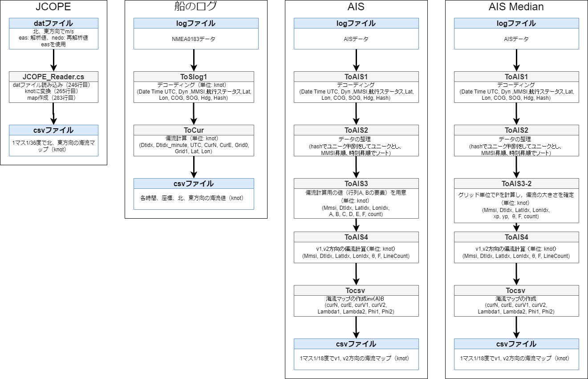

# Introduction
AISデータ，船のログから偏流値を計算する．AISデータから偏流値を計算するプログラムはAIS_Decorderにまとめられ，船のログから偏流値を計算するプログラムはS1-ShipLogToS1にまとめられている．(JCOPE_decorerは衛星データをcsvマップ化するプログラムがまとめられている．)

# How It Works 
## AISデータから偏流値の作成
```
cd AIS_Decorder
sh run.sh 
```

※交点の中央値により偏流値を計算
```
cd AIS_Decorder
sh run.sh 
sh runMedian.sh
```

※値の悪いMMSIを排除した計算
```
cd AIS_Decorder
sh run.sh 
sh runBlackListMultiFiles.sh
```

## 船のログから偏流値の作成
```
cd S1-ShipLogToS1
Program.exe {ShiplogDir}/*.log
```

# Data Flow
